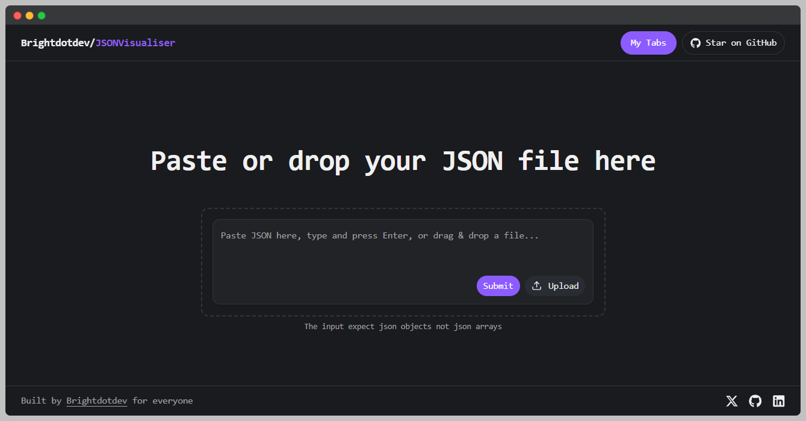

# {} JSONVisualisser
**Visualize, search, and explore JSON data — beautifully.**

This is an interactive JSON visualizer built with **React Flow**, **Next.js**, and **Tailwind CSS**.  
Paste your JSON and watch it transform into an elegant node-based graph you can explore, search, and analyze.



---

## ⚡ Features

- 🔍 **Smart Search** — Find keys or values instantly across deeply nested structures.  
- 🕸️ **Interactive Graph** — Each key/value pair becomes a node connected by edges.  
- 🎨 **Dark + Purple Theme** — Minimal UI with subtle gradients and glow accents.  
- ⚙️ **React Flow Powered** — Smooth panning, zooming, and node interactions.  
- 🧩 **Modular Design** — Easy to extend with new features or data types.


---

## 🚀 Getting Started

Clone the repository and install dependencies:

```bash
git https://github.com/Brightdotdev/JSONVisualisser
cd JSONVisualisser
npm install
````

Run the development server:

```bash
npm run dev
# or
yarn dev
# really any package manager you prefer
```

Open [http://localhost:3000](http://localhost:3000) with your browser to see it in action.

---

## 🧱 Tech Stack

* [Next.js](https://nextjs.org) — App router + deployment ready
* [React Flow](https://reactflow.dev) — Graph rendering and interactivity
* [Tailwind CSS](https://tailwindcss.com) — Styling and layout
* [TypeScript](https://www.typescriptlang.org) — Type safety and clarity

---

## 🪄 Screenshots


---

##  Why I Built This

This project started as a flash thought — *“What if I could actually see my JSON?”*
It quickly turned into an experiment that helped me understand data structures and graph rendering in a deeper way.

---

## 🌍 Live Demo

👉 [Demo Link](https://json-visualisser.vercel.app/)

---

## 💬 Feedback & Feature Requests

I’d love to hear from you!
If you have ideas for improving JSON Flow Visualizer — from UI tweaks to performance enhancements — open an **[issue](https://github.com/Brightdotdev/JSONVisualisser/issues)** or start a **discussion**.

You can also reach out directly on [**Twitter**](https://x.com/Brightdotdev) for quick chats or feedback threads.

---

## 🤝 Contributing

This project is open source and welcomes all contributions!

Here’s how you can help:

1. **Fork** the repository
2. **Create a branch** for your feature or fix
3. **Commit your changes**
4. **Open a Pull Request**

Whether it’s fixing typos, improving the README, optimizing performance, or adding new visualization features — all contributions are welcome frfr

---

##  Who Did This???

Built by [**Brightdotdev**](https://brightdotdev.vercel.app)

If you like this project, drop a ⭐ on the repo or share it so more devs can visualize their JSON data the cool way 😎

---

## 🪶 License

This project is licensed under the **MIT License** — feel free to use, modify, and build upon it.


